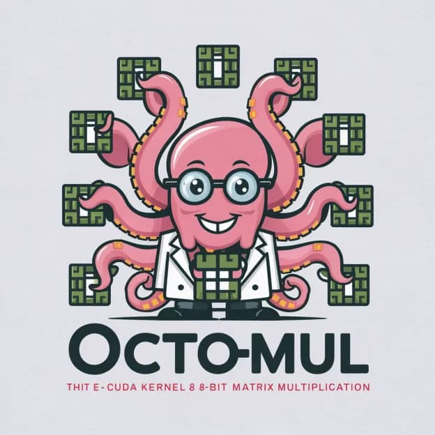

# OctoMul — CUDA Int8 Tensor Core GEMM

  

This int8 gemm kernel gets speeds faster than cuBLAS FP16 (and occasionally cuBLAS Int8). It's also relatively easy to read, hack, fuse, and do whatever you want with.

Hopper and Ada GPUs have fp8 support, but GPUs going back to even the Turing gen have int8 tensor core support.
Things like SmoothQuant are also possible which would enable a 2x inference speedup on the prefill rather than just on the AR decoding (what things like Marlin, FLUTE, and GGML quants typically focus on).

You can install it for yourself with `pip install .` and then run the tests with `python test.py`.

I tuned for kernels for an A40, so if you're using another device the configs might be less than optimal and you'd need to autotune them for said device.

Talk is cheap though, benchmarks are in `/benchmarks`:

I'm still working on improving the kernel so I hope to reach parity with cuBLAS on int8 fully.

---

## License

MIT